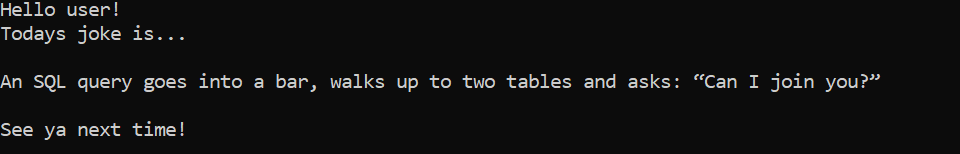

# Jokes Generator

## Table of Content
1. [Introduction](#introduction) 
1. [Techology](#technology)
1. [Usage](#usage)
1. [Meaning of existence](#meaning-of-existence)

---
### Introduction 
If you are a programmmer, or just nerd, this program should make you smile. This project is created for fun, 
don't try to take it seriously. :P

---

### Technology

The only thing you need besides the computer is the node.js. 

You can download and install it from the site's [official website](https://nodejs.org/en/)

---
### Usage

Open your terminal, go to project directory, and write:

`node jokes.js`

---
### Meaning of existence
I'm just joking, here you will not know the answer to that

---
